# Lab-001: Launching an EC2 Instance in a Public Subnet

| Item | Details |
|------|---------|
| **Lab ID** | Lab-01 |
| **Title** | Launching an EC2 Instance in a Public Subnet |
| **Difficulty** | Beginner |
| **Author** | Manoj M |
| **Date** | 19/04/2026 |
| **Primary Goal** | Launch an EC2 instance in a public subnet and access it over the internet |

---

## Overview

This lab demonstrates how to launch an Amazon EC2 instance in a public subnet using the **default VPC**, assign it a public IPv4 address, connect to it using SSH, install a web server, and verify browser access.

---

## Services Used

- Amazon EC2
- Default VPC
- Internet Gateway
- Security Groups

> Note: In this lab, no new VPC or custom EBS volume is created. The instance uses the **default VPC**, **default subnet**, and **default root storage** provided during launch.

---

## Architecture Diagram

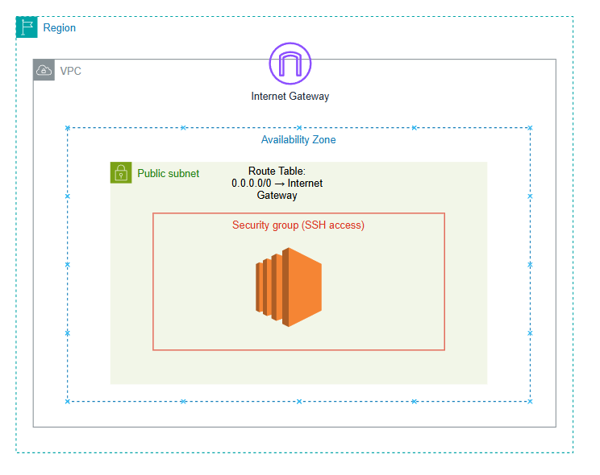

---

## Learning Outcomes

After completing this lab, you will be able to:

- Launch an EC2 instance from the AWS Management Console
- Use the default VPC and default subnet
- Configure public access using a public IPv4 address
- Create and use an SSH key pair
- Configure security group rules for SSH and HTTP
- Connect to the instance using SSH
- Install and start an Apache web server
- Test web access using the public IP address

---

## Key Concepts

- **EC2 Instance**: A virtual machine running in AWS
- **Default VPC**: A pre-created VPC provided by AWS for easy deployment
- **Public Subnet**: A subnet that can reach the internet through an Internet Gateway
- **Public IPv4 Address**: Required for direct access from the internet
- **Security Group**: A virtual firewall controlling inbound and outbound traffic
- **Key Pair**: Used for secure SSH login to the instance
- **Internet Gateway**: Allows communication between resources in the VPC and the internet

---

## How Internet Gateway Works in This Lab

An **Internet Gateway (IGW)** is already attached to the **default VPC** created by AWS. Because of this:

- The default public subnet has a route to the internet
- The EC2 instance can be reached from outside AWS if it has a **public IPv4 address**
- HTTP and SSH traffic can flow between your system and the instance, as long as the **security group** allows it

In this lab, you do **not** create or attach an Internet Gateway manually. AWS has already configured it as part of the default VPC setup.

---

## Step-by-Step Procedure

### Step 1: Open the EC2 Launch Wizard

- Sign in to the AWS Management Console
- Open the **EC2 Dashboard**
- Click **Launch instance**

This opens the instance launch page where all instance settings are configured.

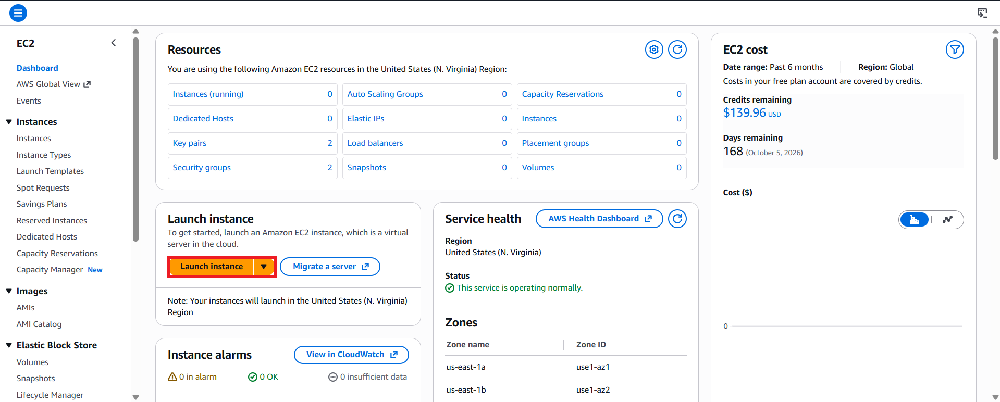

---

### Step 2: Enter an Instance Name

- In the **Name and tags** section, enter a name for your instance
- Example: `Lab-001-EC2`

This makes the instance easier to identify later.

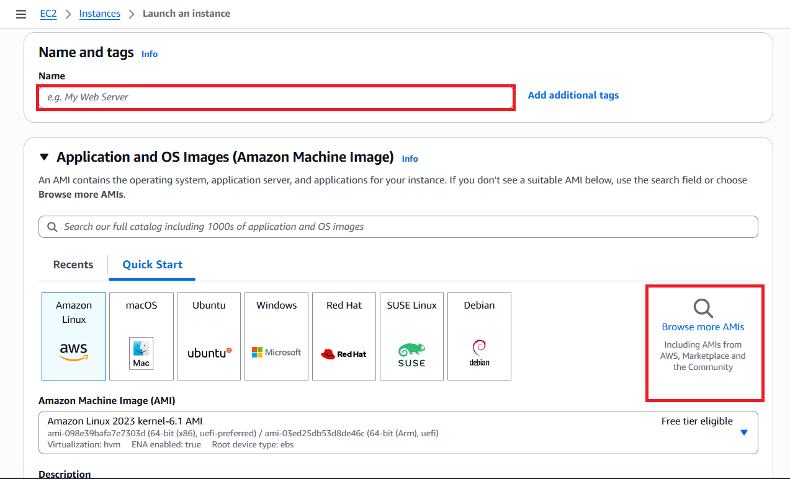

---

### Step 3: Select an Amazon Machine Image (AMI)

- In **Application and OS Images**, choose **Amazon Linux 2023 kernel-6.1 AMI**
- Select the **64-bit (x86)** option
- If needed, click **Browse more AMIs**

Amazon Linux 2023 is a secure and AWS-optimized Linux operating system.

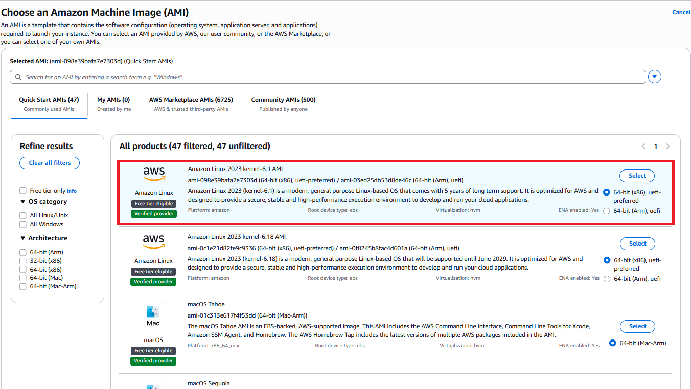

---

### Step 4: Choose the Instance Type

- In the **Instance type** section, select **t3.micro**
- Click **Select instance type**

This instance type is suitable for beginner labs and small workloads.

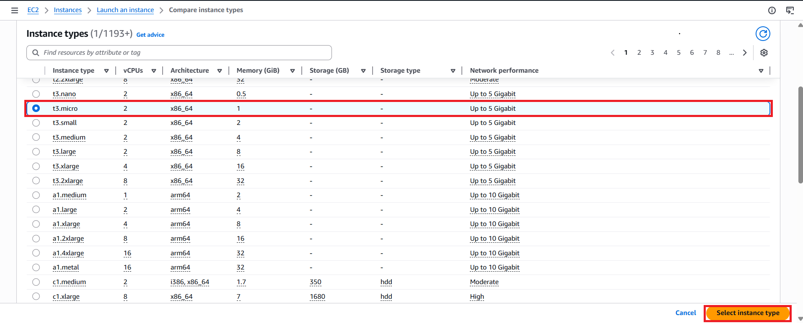

---

### Step 5: Create a Key Pair

- In the **Key pair** section, click **Create new key pair**
- Enter a key pair name such as `pass`
- Select:
  - **Key pair type:** `RSA`
  - **Private key file format:** `.pem`
- Click **Create key pair**
- Save the downloaded `.pem` file securely

This key pair is required for SSH access.

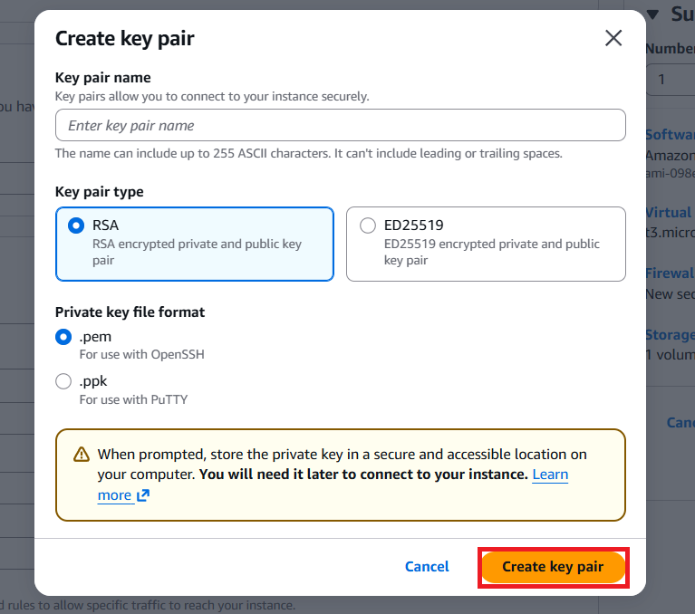

---

### Step 6: Configure Network Settings

- Use the **default VPC**
- Select the **default public subnet**
- Set **Auto-assign public IP** to **Enable**

This ensures the EC2 instance receives a public IPv4 address and can communicate through the Internet Gateway.

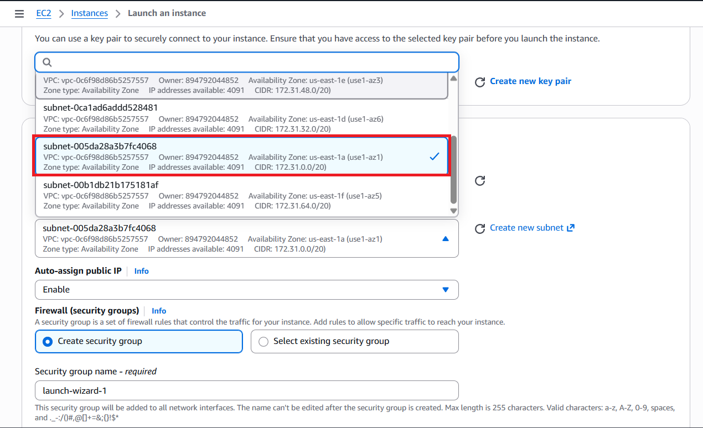

---

### Step 7: Configure Security Group Rules

- Choose **Create security group**
- Allow **SSH traffic** from **My IP**
- Allow **HTTP traffic from the internet**

This allows:
- SSH access on port `22`
- HTTP access on port `80`

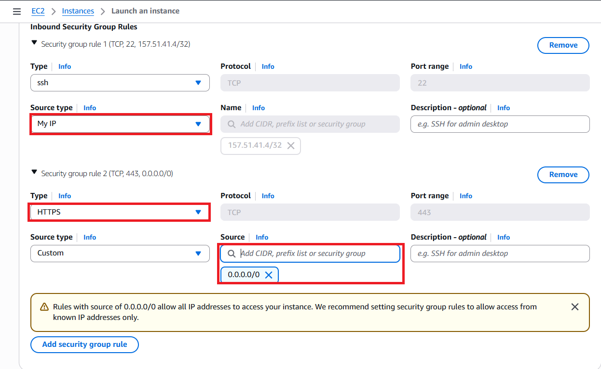

---

### Step 8: Review Storage and Launch the Instance

- Keep the default storage settings provided by AWS
- Review the instance summary
- Click **Launch instance**

> Note: In this lab, no additional EBS configuration is required. The instance uses the default root volume automatically created during launch.

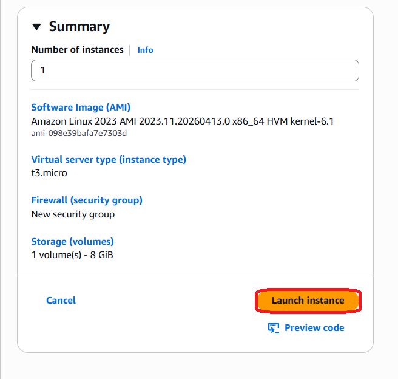

---

### Step 9: Confirm Successful Launch

- After clicking **Launch instance**, AWS shows a success message
- Confirm that the instance has been launched successfully

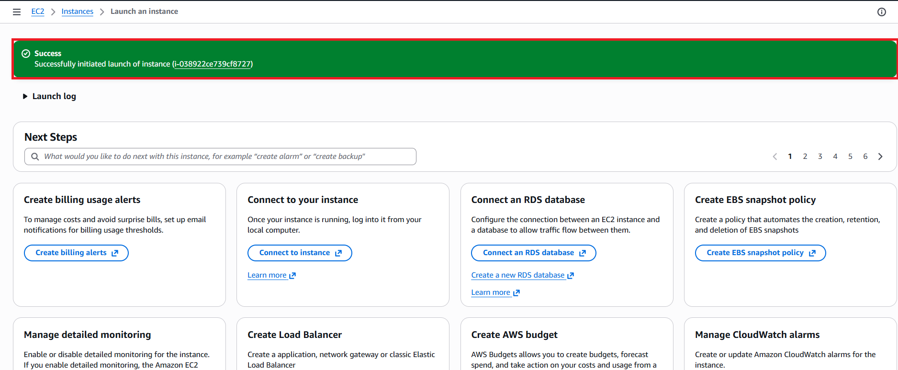

---

### Step 10: Verify Instance Details

- Open the instance details page
- Confirm the following:
  - **Instance state:** `Running`
  - **Public IPv4 address** is assigned
  - **Public DNS** is available

These details confirm the instance is ready and reachable.

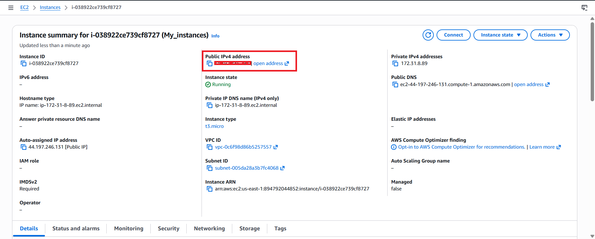

---

### Step 11: Connect to the Instance Using SSH

You can connect to the EC2 instance from different terminal tools depending on your operating system and SSH client.

**Common terminal options include:**

- **Ubuntu Terminal / Linux Terminal**
- **macOS Terminal**
- **Windows PowerShell**
- **Windows Command Prompt**
- **Git Bash**
- **PuTTY** on Windows
- **Windows Subsystem for Linux (WSL)**

> Note: The command format may vary slightly depending on the terminal you use, especially on Windows.

#### Option 1: Ubuntu, Linux, macOS, Git Bash, or WSL

If you are using a Linux-based terminal, macOS Terminal, Git Bash, or WSL, first set secure permissions on the private key:

```bash
chmod 400 pass.pem
```

Then connect to the instance using:

```bash
ssh -i pass.pem ec2-user@44.197.246.131
```

If the connection is successful, you will log in as the `ec2-user` on the Amazon Linux instance.

#### Option 2: Windows PowerShell

If you are using **Windows PowerShell**, you can usually connect directly with:

```powershell
ssh -i .\pass.pem ec2-user@44.197.246.131
```

If PowerShell gives permission-related issues with the `.pem` file, consider using **Git Bash**, **WSL**, or **PuTTY**.

#### Option 3: PuTTY on Windows

If you are using **PuTTY**, note that PuTTY uses a `.ppk` file instead of a `.pem` file.

To connect with PuTTY:

1. Open **PuTTYgen**
2. Load the `.pem` file
3. Convert and save it as a `.ppk` file
4. Open **PuTTY**
5. Enter the public IP address: `44.197.246.131`
6. Go to **Connection > SSH > Auth**
7. Select the `.ppk` file
8. Connect using the username `ec2-user`

**Output Screenshot:**  


---

### Step 12: Update the System and Install Apache HTTP Server

After logging in to the instance, run the following commands:

```bash
sudo yum update -y
sudo yum install httpd -y
```

These commands update the package metadata and install the Apache web server.

**Output Screenshot:**  


---

### Step 13: Start the Web Server

Run the following commands on the EC2 instance:

```bash
sudo systemctl start httpd
sudo systemctl enable httpd
```

This starts Apache immediately and enables it to start automatically after reboot.


---

### Step 14: Create a Simple Test Web Page

Create a simple HTML page to verify the web server is working:

```bash
echo "Hello from EC2" | sudo tee /var/www/html/index.html
```

This writes a basic page to the default Apache document root.


---

### Step 15: Test the Web Server in a Browser

- Copy the **Public IPv4 address** from the instance details page
- Paste it into your browser

If everything is configured correctly, the browser should display:

```text
Hello from EC2
```

**Output Screenshot:**  


---

## Validation Checklist

Use this checklist to confirm the lab was completed successfully:

- EC2 instance launched successfully
- Instance state is `Running`
- Default VPC used
- Default subnet used
- Public IPv4 address assigned
- Auto-assign public IP enabled
- SSH rule added in the security group
- HTTP rule added in the security group
- SSH login successful
- Apache installed successfully
- Browser access works using the public IP

---

## Commands Used in This Lab

```bash
chmod 400 pass.pem
ssh -i pass.pem ec2-user@44.197.246.131
sudo yum update -y
sudo yum install httpd -y
sudo systemctl start httpd
sudo systemctl enable httpd
echo "Hello from EC2" | sudo tee /var/www/html/index.html
```

---

## Expected Result

At the end of this lab:

- The EC2 instance is running in the default VPC
- The instance has a public IPv4 address
- You can connect to it using SSH
- Apache is installed and running
- The web page is accessible through the browser using the instance's public IP address

---

## Common Mistakes

- Not enabling **Auto-assign public IP**
- Not allowing **SSH** in the security group
- Not allowing **HTTP** in the security group
- Using the wrong `.pem` file
- Incorrect private key permissions
- Forgetting to start Apache
- Trying to open the browser before the instance is fully running

---

## Conclusion

In this lab, an EC2 instance was launched in a public subnet inside the **default VPC**. A public IP address was assigned, SSH access was configured using a key pair, and Apache was installed to host a simple web page. The instance was then successfully accessed through both SSH and a web browser.
